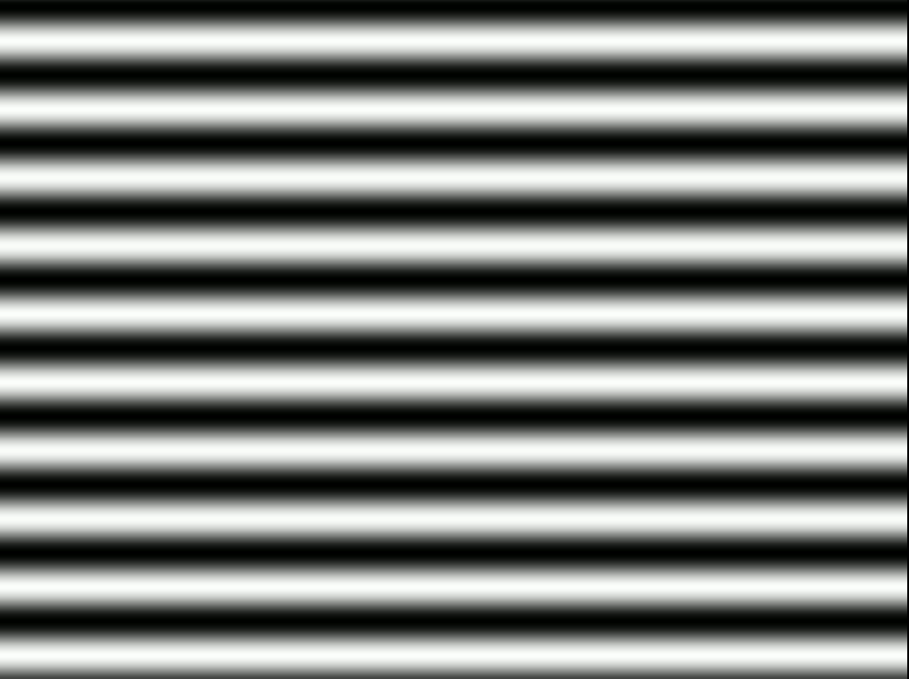
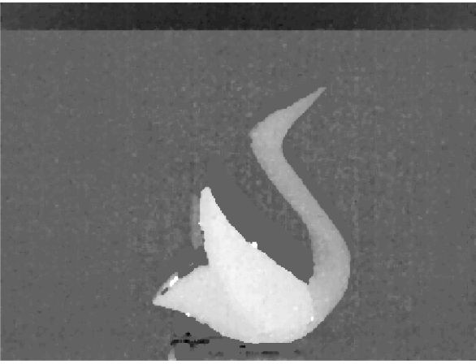

# Neuromorphic Fringe Projection Profilometry

This repository contains implementation of Neuromorphic Fringe Projection Profilometry method proposed by <a href="https://ieeexplore.ieee.org/abstract/document/9166707"> Rao Mangalore et. al</a>. 

The data in the experiments folder have been collected from a DAVIS346 Camera. The  <a href="https://github.com/uzh-rpg/rpg_dvs_ros">drivers </a> developed by the robotics and perception group were used to collect data from the DAVIS. 

An object is placed on a platform and a moving light source generated in `generator.py` is made to fall on the object. The videos folder contains different patterns used with the light source generated using the generator file. Some examples of Patterns are shown below.

<table style="width:100%">
    <tr>
        <td style="text-align:center"> </td>
        <td style="text-align:center"> </td>
    </tr>
</table>

# Procedure
The event camera, placed in a stereo configuration with the <a href="http://www.ti.com/tool/DLPLCR4500EVM">light projector</a> ,records the Wrapped phase of the incident light. The phase is then unwrapped and triangulated to get depth maps.

Before starting the execution, please download the data from this  <a href="https://drive.google.com/drive/folders/1DChe45OtZhLeuBitztfafJeo-j0zl9eQ?usp=sharing">link</a>

Once you have downloaded files from the above link and extracted them to a folder called `data/`, run the files execute with the following commands: 

`python correlate_and_phase.py`

The above command would compute wrapped phase at all the pixel locations. We then run the following command,

`python shadow_fill_and_depth.py`

This commmand compensates for shadows and calculates the final unwrapped phase and the depth maps. The wrapped and unwrapped phase calculated for various objects are shown below,

Note that the `correlate_and_phase.py` script has to be first run for the reference fringes i.e We must first calculate wrapped phase without any objects placed. We then move on to change the object name to calculate depth maps for different objects. To run for different object change the `object_type` and `spatial_frequency` variables in the `main()` function in the `correlate_and_phase.py` file. The same applies to the `shadow_fill_and_depth.py` file. In case you are using a camera other than DAVIS346, camera dimensions can be changed by changing the `cam_dims` variable. The output is a .xyz file. The .xyz files can be imported in meshlab and meshed to get 3D results.

The depth maps obtained are as follows

<table style="width:100%">
    <tr>
        <td style="text-align:center"> </td>
        <td style="text-align:center"> </td>
        <td style="text-align:center"> </td>
    </tr>
</table>

To understand how events occur in an event based camera, please watch the video at this <a href="https://www.youtube.com/watch?v=kPCZESVfHoQ">link.</a>

Below are the links to different types of Event Cameras,

1. <a href="http://inivation.com/"> DAVIS </a>

2. <a href="https://www.prophesee.ai/"> ATIS </a>

## Citation
If you happen to use this repository in your work or research please cite it as follows:

A. R. Mangalore, C. S. Seelamantula and C. S. Thakur, "Neuromorphic Fringe Projection Profilometry," in IEEE Signal Processing Letters, vol. 27, pp. 1510-1514, 2020, doi: 10.1109/LSP.2020.3016251. 

>

    @ARTICLE{mangalore2020nfpp,
    author={A. R. {Mangalore} and C. S. {Seelamantula} and C. S. {Thakur}},
    journal={IEEE Signal Processing Letters}, 
    title={Neuromorphic Fringe Projection Profilometry}, 
    year={2020},
    volume={27},
    pages={1510-1514},}

<h4 align="center">Published in <i>Signal Processing Letters</i> <a href="https://ieeexplore.ieee.org/abstract/document/9166707">10.1109/LSP.2020.3016251</a></h4>
